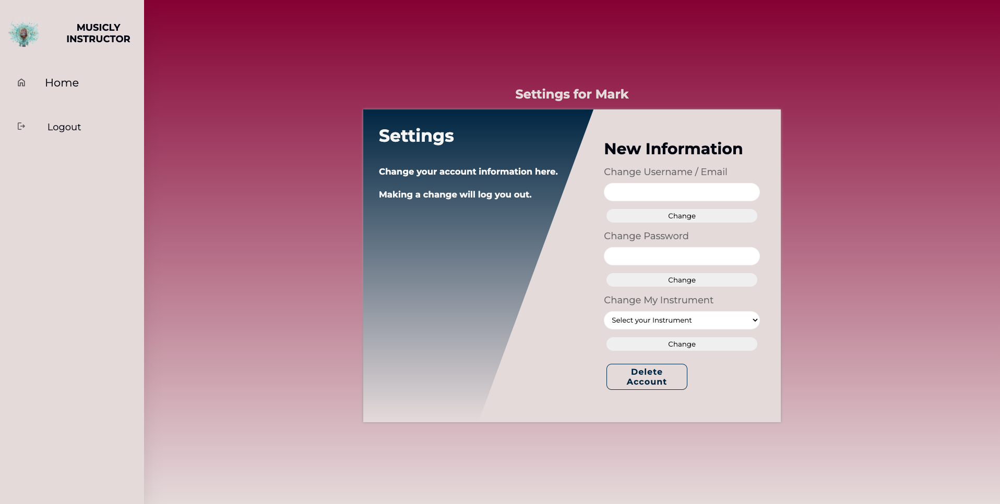

# **_Musicly_**

"Musicly" is an online application where music instructors and students can coordinate private lessons. This website utilizes a full-stack coding library (HTML, CSS, JavaScript, Node.js, Express.js, Postgres, and Sequelize).

---

## **Created By**

---

### Blake Lein

### Ethan Gula

Published August 2022

[Email Me](blake.lein@gmail.com) | [GitHub](https://github.com/BlakeLein/Musicly) | [LinkedIn](https://www.linkedin.com/in/blake-lein-bb6187238)

[You can view an article I wrote about the making of this project here](https://medium.com/@blake.lein/lessons-in-full-stack-8ee5911553bb)

---

## **Requirements**

Musicly is deployed online, so all you need to get started is this link: ("""")

## How Musicly Works

---

### Wesbite Overview

Musicly is an online web application that utilizes a full-stack coding library to give instructors and students the ability to schedule and cancel private music lessons. Instructors can create lesson slots to include date, start and stop time, and cost. Students can track all available lessons that their teacher has created and claim them so no other student can. These claimed lessons appear in their "My Lessons" tab and simultaneously show up in their teacher's "Claimed Lessons" tab. Since Musicly requires a password-protected account, all information is confidential between the instructor and student

---

### Website Features

Here are some of the website's features in greater detail:

- Password-protected accounts for instructor and student privacy.
- Resonsive on all media devices.
- "Create Lesson" feature for instructors to build out their schedule based on dates, times, and cost.
- Instructors can cancel and remove students from their schedule.
- Ability for students to claim available lessons and have them show up as claimed on their instructor's account.
- Full capabilities for updating account information or deleting your account altogether.

---

## "Discover America" In Development

This website represents the third major project in our Digital Crafts coursework and demonstrates our first full-stack project. Musicly utilizes HTML, CSS, JavaScript, Node.js, Express.js, PostgreSQL, and Sequelize.

As our projects have gotten bigger, so also has the potential for each project. Here are some ways we might expand Musicly:

- Creating an authentication system for users creating their accounts.
- Creating an approval process for instructors signing up.
- Adding a messaging feature to the app for students and parents to communicate directly through the app.
- Sorting the lesson slots by date with an automatic expiration system.
- A "calendar" layout for created lessons to appear in a neat format.

## Photos of Musicly

